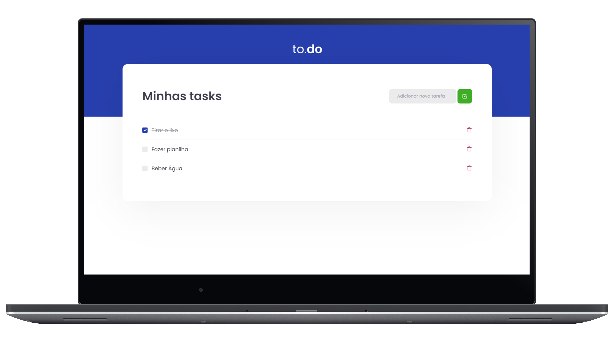
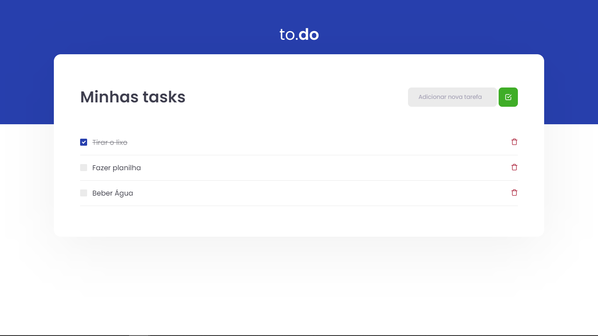

<h1 align="center" style="color: #f1f1f1; font-size: 4rem; font-weight: bold">To.Do</h1>

<div align="center">

![GitHub][repository_license_badge] ![React_Badge][web_react_badge] ![Types][typescript] ![Next][next]
<br>

<p align="center">
 <a href="#-projeto"><strong/><h3/>Projeto</a> •
 <a href="#-layout">Layout</a> •
 <a href="#-ecnologias">Tecnologias</a> •
 <a href="#-como-executar-o-projeto">Executando</a> •
 <a href="#-referencias">Referências</a> •
 <a href="#-author">Autor</a> 
</p>

<p align="center">
  
</p>
</div>


---

## **💻 Projeto**
<p style="font-weight: lighter;">
Um projeto desenvolvido durante o <b>Bootcamp Ignite</b> da <b>Rocketseat</b>, o projeto "To Do" é um projeto basico de listagem de tarefas que pode tanto ser utilizado em trabalho como com coisas do dia a dia, podendo criar tarefas novas confirmar tarefas comcluidas e exclui-las tambem.
 <br>
 <br>
 * <b>Acesse o Projeto Online<b>: https://todoawesome.vercel.app 
</p>

---

## **🔖 Layout**


#### **Web**
<p align="center">
  
</p>


---

## **:computer: Tecnologias**


 #### **Website** ([React][react])
 
  - **[Typescript][typescript]**
  - **[Webpack][webpack]**
   
> \* Veja o arquivo <kbd>[package.json](./package.json)</kbd>

 #### **Utilitários**
 
  - Editor: **[Visual Studio Code][vscode]** 
 - Markdown: **[StackEdit][stackedit]**, **<kbd>[Markdown Emoji][markdown_emoji]</kbd>**

---

##  **🚀 Como executar o projeto**

### Configurações Iniciais

Primeiro, você precisa ter o <kbd>[NodeJS](https://nodejs.org/en/download/)</kbd> instalado na sua máquina. 

Se você estiver utilizando o **Linux**, você pode optar por instalar o **Node** através do gerênciador de versões <kbd>[asdf]</kbd> para facilitar o processo de mudança da versão do **Node**, quando for necessário.

Você pode optar também por utilizar o **yarn** no lugar do **npm**. Você pode instalar clicando nesse <kbd>[link][yarn]</kbd>, ou através do <kbd>[asdf]</kbd>.

Após ter o **Node** instalado, instale as dependências do **React** de forma global, utilizando os comandos:

Instale as dependências contidas nos arquivos `package.json` que se encontram na raíz do repositório. Para instalar as dependências, basta abrir o terminal no diretório e digitar o comando:

```sh
$ npm install

# ou
$ yarn
```

> Veja a parte de **scripts {}** do arquivo <kbd>[package.json](./package.json)</kbd> para saber quais scripts estão disponíveis.


### Executando o WebSite

```sh
# Executando o website no modo de desenvolvimento:
$ npm run dev

    OU

# Executando o website no modo de desenvolvimento:
$ yarn dev
```
> Se o browser não abrir automaticamente, acesse: http://localhost:8080.

---

## **:books: Referências**

- [Blog Rocketseat](https://blog.rocketseat.com.br/)
- [ReactJS](https://reactjs.org/docs/getting-started.html) | [ReactJS pt-BR](https://pt-br.reactjs.org/docs/getting-started.html)
- [Node](https://nodejs.org/en/)

## **👨‍🚀 Autor**

<a href="https://github.com/jairodoni">
 
 <br />
 <sub><b>Jairo Doni Prudente Junior</b></sub></a>
 <br />

👋 Entre em contato!

[](https://www.linkedin.com/in/jairodoni/)
[](mailto:jairo.doni97@gmail.com)

## **:memo: Licença**

Esse projeto está sob a licença MIT. Veja o arquivo [LICENSE](LICENSE.md) para mais detalhes.


<!-- Website Links -->

[rocketseat_site]: https://rocketseat.com.br/

<!-- Badges -->

[repository_license_badge]: https://img.shields.io/github/license/JairoDoni/NLW-1.0

[web_react_badge]: https://img.shields.io/badge/web-react-blue

[typescript]: https://img.shields.io/badge/types-Typescript-blue

[next]: https://img.shields.io/badge/ReactJS-Next.js-lightgrey

<!-- Techs -->

[react]: https://reactjs.org/

[node]: https://nodejs.org/en/

[vscode]: https://code.visualstudio.com/

[react_native]: http://www.reactnative.com/

[stackedit]: https://stackedit.io

[vscode_sqlite_extension]: https://marketplace.visualstudio.com/items?itemName=alexcvzz.vscode-sqlite

[markdown_emoji]: https://gist.github.com/rxaviers/7360908

[commitlint]: https://github.com/conventional-changelog/commitlint

[feather_icons]: https://feathericons.com/

[next]: https://nextjs.org/

[typescript]: https://www.typescriptlang.org/

[axios]: https://github.com/axios/axios

[dotenv]: https://github.com/motdotla/dotenv

[expo]: https://expo.io/

[expo_google_fonts]: https://github.com/expo/google-fonts

[react_navigation]: https://reactnavigation.org/

[expo_constants]: https://docs.expo.io/versions/latest/sdk/constants/

[supertest]: https://github.com/visionmedia/supertest

[cross_env]: https://github.com/kentcdodds/cross-env

[asdf]: https://github.com/asdf-vm/asdf

[yarn]: https://classic.yarnpkg.com/en/docs/install/#debian-stable

[webpack]: https://webpack.js.org
